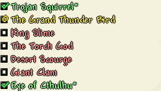

# TODO:
## Layouts
### Ore
Ingot
>Raw Ore Item
>Raw Ore Block
>Ore Block
>Ingot Block
>Weapon/Tools
>Armor
>>Head
>>Body
>>Leggings
>>Boots

## Pre-Hardmode
### Tier 1

 - [ ] Start
	 - [ ] Starter Items
		 - [ ] Copper Shortsword
		 - [ ] Copper Broadsword
		 - [ ] Copper Bow
		 - [ ] Copper Pickaxe
		 - [ ] Copper Axe
		 - [ ] Guidebook &#8594; with [Patchouli](https://github.com/VazkiiMods/Patchouli) ([Guide](https://vazkiimods.github.io/Patchouli/docs/patchouli-basics/getting-started/))
	 - [ ] Mobs
		 - [ ] Slime
		 - [ ]  
 - [ ] Trojan Squirrel
 - [ ] Grand Thunder Bird
 - [ ] King Slime
 - [ ] The Torch God
 - [ ] Desert Scourge
 - [ ] Giant Clam
 - [ ] Eye of Cthulu

### Tier 2
### Tier 3
### Tier 4
## Hardmode
### Tier 5
### Tier 6
### Tier 7
### Tier 8
### Tier 9
### Tier 10
## Post MoonLord
### Tier 11
### Tier 12
### Tier 13
### Tier 14

>Starter Bag
>> Copper/Tin Ore
>> Copper/Tin Ore Shortsword
>>

### Setup for new Ore:
>Raw Ore item
>Raw Ore Block
>Ore Block
>Ingot/Gem
> Armor
> Tools
>> Pickaxe
>> Axe
>> Hammer?
>Weapons
>> Sword

<!--stackedit_data:
eyJoaXN0b3J5IjpbOTE0NjMyNjUsMTIwNDMwNTU4LDE5OTA4Mj
g0MDIsLTU1ODc0MjY1MiwtODY2NTc5ODU5LC01MTUwMzg1MjEs
MTQ3NzMzNzcxNyw2NjgyNjkxNTMsLTc1NzkxODk3LC05NjY3MT
E2NTksLTIxMjg2OTM4NzYsLTE0Njg4NTEwNTYsLTExODc3MzY1
MSw4Mzg3OTk5NiwxMzQ4MjY1NTc2XX0=
-->