# TODO:
## Inhaltsangabe
>[Layouts](#layouts)
>>[Ore](#ore)
>>[Class Setup](#class-setups)
>>[Mechanics](#mechanics)
>>[Progression](#progression)
>
>[Pre Hardmode](#pre-hardmode)
>>[Tier 1](#tier-1)
>>[Tier 2](#tier-2)
>>[Tier 3](#tier-3)
>>[Tier 4](#tier-4)
>
>[Hardmode](#hardmode)
>>[Tier 5](#tier-5)
>>[Tier 6](#tier-6)
>>[Tier 7](#tier-7)
>>[Tier 8](#tier-8)
>>[Tier 9](#tier-9)
>>[Tier 10](#tier-10)
>
>[Post-MoonLord](#post-moonlord)
>>[Tier 11](#tier-11)
>>[Tier 12](#tier-12)
>>[Tier 13](#tier-13)
>>[Tier 14](#tier-14)

## Layouts
### Ore
Ingot
>Raw Ore Item
>Raw Ore Block
>Ore Block
>Ingot Block
>Weapon/Tools
>Armor
>>Head
>>Body
>>Leggings
>>Boots
### Class Setups

#### All Classes
>Weapons
>Ammo/Buffs/Potions
>Armor
>Accessories
#### Melee
>Weapons
>> Shortswords
>>Broadswords
>>Yoyos
>>Spears
>>Boomerangs
>>Flails
>>Other
>
>Ammo/Buffs/Potions
>Armor
>Accessories
#### Ranged
>Weapons
>>Bow
>>Gun
>>Repeater
>>Consumables
>>Launchers
>>Others
>
>Ammo/Buffs/Potions
>Armor
>Accessories
#### Magic
>Weapons
>>Wands
>>Magic Guns
>Spell Books
>Others
>
>Ammo/Buffs/Potions
>Armor
>Accessories
#### Summoner
>Weapons
>>Minions
>>Sentries
>>Whips
>
>Ammo/Buffs/Potions
>Armor
>Accessories
#### Rogue
>Weapons
>>Bombs
>>Boomerangs
>>Daggers
>>Javelins
>>Spiky Balls
>>Others
>
>Ammo/Buffs/Potions
>Armor
>Accessories
#### Healer
>Weapons
>>Healing Spells
>>Support Spells
>>Scythes
>>Maces
>>Other
>
>Ammo/Buffs/Potions
>Armor
>Accessories
#### Bard
>Weapons
>>Brass Instruments
>>Percussion Instruments
>>String Instruments
>>Wind Instruments
>>Electronic Instruments
>
>Ammo/Buffs/Potions
>Armor
>Accessories
### Mechanics
#### Rarity
#### NPC
#### Difficulty
>##### Normal Mode
>##### Revengeance Mode
>##### Death Mode
>##### Eternity Mode
### Progression

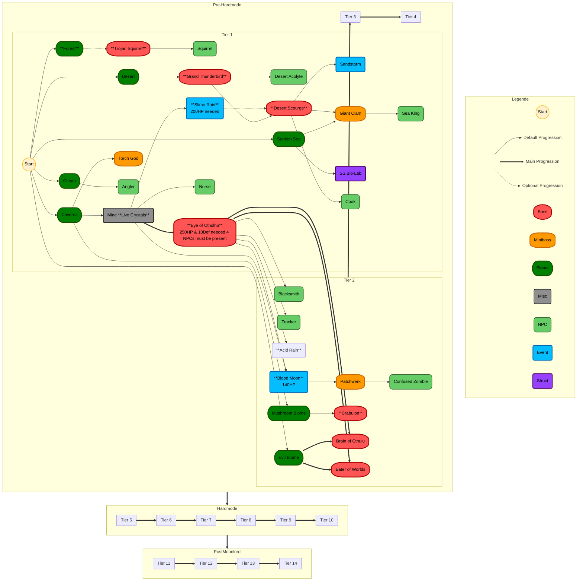
## Pre-Hardmode
### Tier 1

- [ ] Start
	- [ ] Starter Items
		- [x] Copper Shortsword [`Me`](#melee)
		- [x] Copper Broadsword  [`Me`](#melee)
		- [ ] Copper Bow  [`Ra`](#ranged)
		- [ ] Copper Pickaxe
		- [ ] Copper Axe
		- [ ] Guidebook &#8594; with [Patchouli](https://github.com/VazkiiMods/Patchouli) ([Guide](https://vazkiimods.github.io/Patchouli/docs/patchouli-basics/getting-started/))
			- [ ] Entries
				- [ ] Bestiary
				- [ ] Progression Path
				- [ ] NPCs
				- [ ] Rarity Explained
				- [ ] Difficulty
		- [ ] Amethyst Staff [`Ma`](#magic)
	- [ ] Environment
		- [ ] Copper Ore
		- [ ] Tin Ore 
		- [ ] Amethyst
		- [ ] Topaz
	- [ ] Mobs
		- [ ] Slime
		- [ ] Squirrel
		- [ ] NPC
			- [ ] Guide
			- [ ] Merchant
	- [ ] Items
		- [ ] Tin Weapons & Tools
		- [ ] Copper Weapons & Tools
		- [ ] Bug Net
	- [ ] Mechanics
		- [ ] NPC
			- [ ] House System
			- [ ] Dialog System
			- [ ] Shop System
			- [ ] Happiness System
		- [ ] Money System
	- [ ] Advancements
		- [ ] Start
- [ ] Trojan Squirrel
	- [ ] Environment
		- [ ] Platin Ore
		- [ ] Gold Ore (Upgrade)
		- [ ] Thorium Ore
- [ ] Grand Thunder Bird
- [ ] King Slime
- [ ] The Torch God
- [ ] Desert Scourge
- [ ] Giant Clam
- [ ] Eye of Cthulu

### Tier 2

### Tier 3
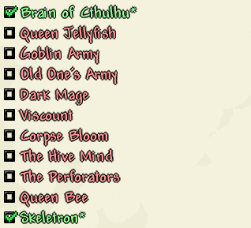

### Tier 4
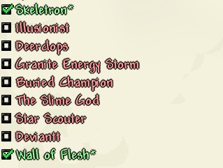

## Hardmode
### Tier 5
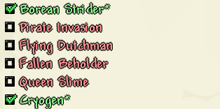

### Tier 6
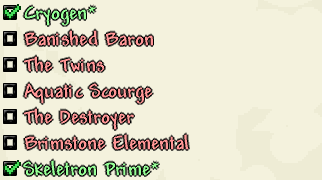

### Tier 7
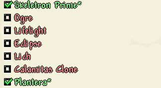

### Tier 8
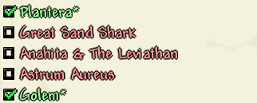

### Tier 9
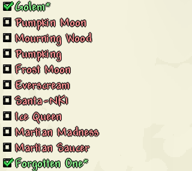

### Tier 10
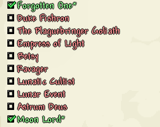

## Post MoonLord
### Tier 11

### Tier 12
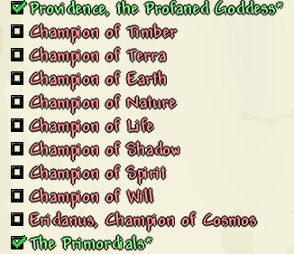

### Tier 13
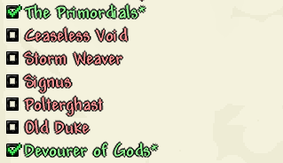

### Tier 14
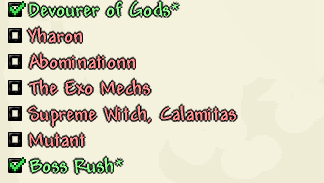
<!--stackedit_data:
eyJoaXN0b3J5IjpbMTg4MzU0MTM0NiwxODgzNTQxMzQ2LDMyOD
IzMDkzMiwtMTI4NDU3NTQxLDEyNDM3NTI0NDcsLTYwNzY3OTcw
LDE2ODgxOTU2MDUsLTE5MjQ4OTg2NzMsLTEyOTgyNTgyNDksLT
E3MDg1OTUyNTMsLTY0MjM5MTAyMSwxNzAyNTgxMTMyLC0xMTkx
OTgxMzE2LDY5MTM5ODQ3MSw1MzEzNzE1OTEsMTA1NjEzMzg4Mi
wxMTM0OTMxOTM5LC05MzIwODU1MDAsLTI2NDk1OTQ5NCwtNjM1
NTAzMjEyXX0=
-->